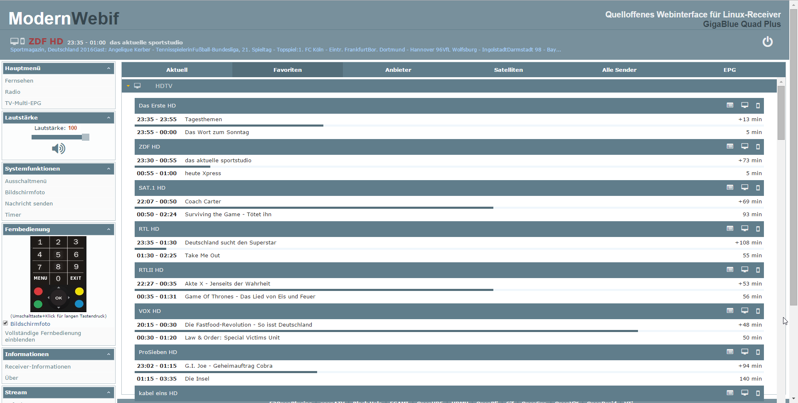
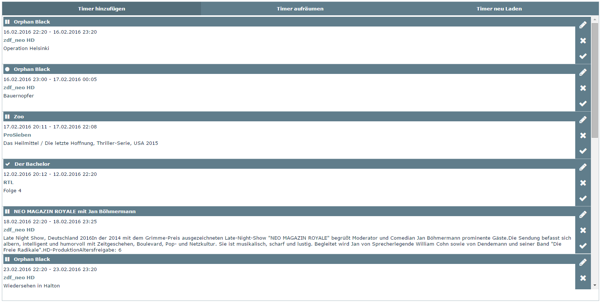

ModernWebif
=========
Open Source Web Interface for E2 based Linux set-top box
Based on [OpenWebif](https://github.com/E2OpenPlugins/e2openplugin-OpenWebif).

Themed by MDXDave

Known Issues
-------
* MultiEPG/Bouqueteditor not themed yet!
* Minor glitches

Screenshots
-------
TV bouquets

Timerlist

Depends
-------
python-pprint
python-cheetah
python-json
python-unixadmin
python-misc
python-twisted-web
python-pyopenssl
python-compression

License
-------
Licensed under the GNU General Public License, Version 2.0. See [LICENSE](https://github.com/MDXDave/ModernWebif/blob/master/LICENSE) for more details.
